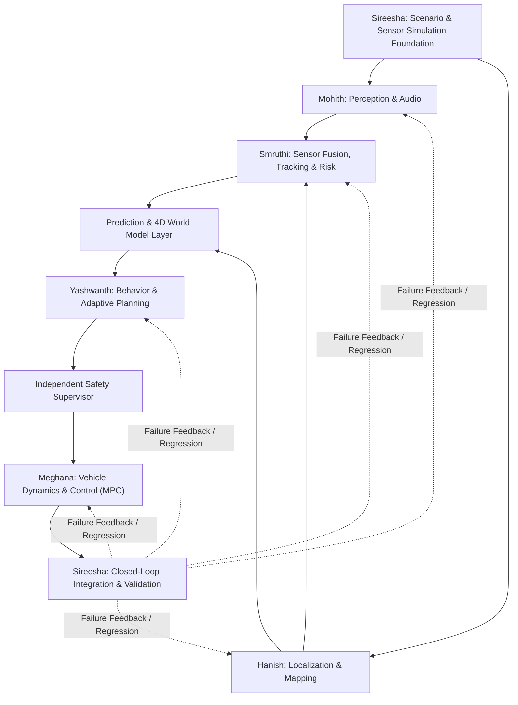

# Adaptive Path Planning and Collision Avoidance for Autonomous Vehicles on Unstructured Indian Roads

### Smart India Hackathon (SIH) • Problem Statement 26037
**A Six-Person Software Research & Autonomous Driving System Project**

---

## 1. Project Overview & Objective

Autonomous driving on unstructured Indian roads presents challenges unseen in structured western environments:
- **Missing or degraded lane markings & unpaved shoulders**
- **Heterogeneous & highly mixed traffic** (pedestrians, motorcycles, auto-rickshaws, heavy trucks, stray animals)
- **Informal road hazards** (potholes, speed breakers, debris, construction, water logging)
- **Unpredictable driver behavior & horn-based acoustic driving cues**
- **Extreme operational environments** (heavy monsoon rain, dust, fog, low light, narrow urban gullies, and mountain ghat hairpin roads)

### Golden Architecture Rule
> **Do not build six disconnected sub-projects.** Every member owns a dedicated module, adheres strictly to defined message interfaces, validates with measurable tests, and hands off a validated output to the next module in the closed-loop pipeline.

```
SENSE -> ESTIMATE -> FUSE -> PREDICT -> WORLD MODEL -> DECIDE -> PLAN -> SAFETY -> CONTROL -> SIMULATE -> TEST -> FEEDBACK
```



---

## 2. Team Ownership & Core Responsibilities

| Member | Module Ownership | Core Question | Main Hand-offs / Output |
| :--- | :--- | :--- | :--- |
| **Mohith** | AI Perception + Sensor Simulation + Audio | *"What do I see/hear?"* | `Detection2D`, `Detection3D`, Drivable Masks, Road Boundaries, `AudioEvent` |
| **Hanish** | Localization + SLAM + Mapping | *"Where am I?"* | `EgoState`, `MapOccupancy`, Coordinate Frames & Transforms |
| **Smruthi** | Fusion + Tracking + Collision Risk | *"What are objects doing?"* | `TrackState` (Multi-object tracks), `RiskState` (TTC, clearance, uncertainty) |
| **Prediction / World** | 4D World Model & Motion Prediction | *"What happens next?"* | `PredictionState` (Intents, future paths), `WorldState` (Unified 4D scene) |
| **Yashwanth** | Behavior Decision + Adaptive Planning | *"What should we do?"* | `BehaviorCommand` (Maneuver states), `Trajectory` (Time, pose, speed, curvature) |
| **Meghana** | Vehicle Dynamics + Control | *"How do we execute it?"* | `ControlCommand` (Steering, throttle, brake), `VehicleFeedback` (Errors, feasibility) |
| **Sireesha** | Simulation + Integration + Testing | *"Does it work?"* | Scenario logs, `ValidationResult`, Canonical Scenarios, Regression Suite |

---

## 3. Standardized Message & Interface Contracts

All modules communicate using standardized, timestamped SI units (metres, seconds, radians, m/s, $\text{m/s}^2$). Any learned output includes confidence $[0.0, 1.0]$ and estimation outputs include covariance.

| Message | Producer $\rightarrow$ Consumer | Required Minimum Content Fields |
| :--- | :--- | :--- |
| `Detection2D` | Mohith $\rightarrow$ Smruthi | `timestamp`, `sensor_id`, `class`, `bbox`, `confidence` |
| `Detection3D` | Mohith $\rightarrow$ Smruthi | `timestamp`, `class`, `position` $[x, y, z]$, `size`, `heading`, `confidence` |
| `AudioEvent` | Mohith $\rightarrow$ Smruthi / Yashwanth | `timestamp`, `event` (siren, horn, revving), `DoA` (direction of arrival), `confidence` |
| `EgoState` | Hanish $\rightarrow$ Smruthi / Yashwanth / Meghana | `timestamp`, `pose` $[x, y, z]$, `velocity` $[v_x, v_y, v_z]$, `heading` $\psi$, `covariance` |
| `MapOccupancy` | Hanish $\rightarrow$ Yashwanth / Sireesha | `timestamp`, `frame_id`, `drivable_area`, `boundaries`, `occupancy_grid` |
| `TrackState` | Smruthi $\rightarrow$ Prediction / Yashwanth | `track_id`, `class`, `pose`, `velocity`, `acceleration`, `covariance` |
| `RiskState` | Smruthi $\rightarrow$ Yashwanth / Safety | `TTC` (time-to-collision), `clearance` (min distance), `risk_level`, `uncertainty` |
| `PredictionState` | Prediction $\rightarrow$ Yashwanth / Safety | `track_id`, `future_trajectories` (multi-modal), `intent`, `uncertainty` |
| `WorldState` | World Layer $\rightarrow$ Yashwanth / Safety | `ego_state`, `actors`, `occupancy`, `boundaries`, `predictions`, `audio_context` |
| `BehaviorCommand` | Yashwanth $\rightarrow$ Planner / Safety | `maneuver_state` (FOLLOW, OVERTAKE, YIELD, AVOID, STOP, etc.), `constraints` |
| `Trajectory` | Yashwanth $\rightarrow$ Safety / Meghana | `time`, `x`, `y`, `yaw`, `velocity`, `acceleration`, `curvature` $\kappa$ |
| `SafetyStatus` | Safety Supervisor $\rightarrow$ Planner / Meghana | `safe` (`'safe'` / `'reject'`), `TTC`, `clearance`, `reason`, `emergency_flag` |
| `ControlCommand` | Meghana $\rightarrow$ Sireesha (Simulator) | `timestamp`, `steering` $\delta$, `throttle` $[0, 1]$, `brake` $[0, 1]$, `accel_cmd` |
| `VehicleFeedback` | Meghana $\rightarrow$ Yashwanth (Planner) | `cross_track_err`, `heading_err`, `lat_accel`, `slip_angles`, `feasibility_code` |
| `ValidationResult` | Sireesha $\rightarrow$ All Members | `scenario_id`, `metrics` (RMSE, jerk, safety margin), `pass_fail`, `failure_reason` |

---

## 4. Master Repository Structure

The repository is structured so each team member works within their designated module while consuming shared configurations and interfaces:

```
Advitiya_Adaptive_path_planning/
├── config/                         # Common vehicle, road, and tuning parameters
│   ├── vehicle_params.m            # Dimensions, inertia, tire cornering stiffness, road friction (mu)
│   └── controller_params.m         # Controller gains (Pure Pursuit, Stanley, MPC, PID)
├── interfaces/                     # Universal interface schemas & validation functions
│   ├── validate_interfaces.m       # Contract checker for Trajectory, EgoState, SafetyStatus
│   ├── create_control_command.m    # Serializer for Simulator commands
│   └── create_vehicle_feedback.m   # Serializer for Planner closed-loop feedback
├── perception/                     # [MOHITH] Camera/LiDAR/Audio detection & segmentation
├── localization/                   # [HANISH] GNSS/RTK, IMU, EKF ego-state estimation & local mapping
├── fusion/                         # [SMRUTHI] Multi-sensor track association, Kalman filters & TTC risk
├── prediction/                     # [PREDICTION/WORLD] 4D world model & actor intent trajectory predictor
├── planning/                       # [YASHWANTH] Stateflow behavior manager & hybrid adaptive path planner
├── controllers/                    # [MEGHANA] Path tracking & vehicle dynamics execution
│   ├── pure_pursuit_controller.m   # Baseline 1: Geometric lookahead tracking
│   ├── stanley_controller.m        # Baseline 2: Front-axle tracking with curvature feedforward
│   ├── longitudinal_controller.m   # Longitudinal PID + resistance drag feedforward + throttle/brake split
│   ├── mpc_controller.m            # Advanced: Curvilinear Model Predictive Control with DARE Riccati solver
│   ├── safety_override.m           # Deterministic emergency stop & traction loss arbitration
│   └── vehicle_control_executive.m # Master control manager interfacing with team contracts
├── models/                         # [MEGHANA] Vehicle physical plant & actuator simulation
│   ├── kinematic_bicycle.m         # 4-DOF kinematic bicycle model (RK4 integrator)
│   ├── dynamic_bicycle.m           # 3-DOF dynamic bicycle with nonlinear tire saturation (Pacejka/Brush)
│   └── actuator_model.m            # 1st-order servo lags, steering rate limiters & jerk constraints
├── simulation/                     # [SIREESHA] Closed-loop simulation engine, RoadRunner/CARLA bridges
│   └── simulate_closed_loop.m      # Closed-loop test engine running plant against planner trajectories
├── simulink/                       # [MEGHANA & SIREESHA] Programmatic Simulink block diagrams
│   ├── vehicle_control_system.slx  # Complete Simulink model with scopes and function blocks
│   └── build_simulink_model.m      # Automated builder script for the Simulink model
├── scenarios/                      # Canonical Indian road test cases
│   └── generate_scenarios.m        # Pothole dodge, ghat hairpin, double lane change, cow/pedestrian emergency
├── tests/                          # Integration & benchmark test scripts
│   └── run_benchmark.m             # MATLAB automated performance benchmark suite
├── python_sim/                     # Standalone Python verification suite (NumPy / SciPy)
│   └── run_simulation.py           # Rapid simulation runner & plot generator
└── docs/                           # Documentation, reports, architecture diagrams & SIH PPT slides
```

---

## 5. Development Milestones & Incremental Loops

Do not wait for full modules before testing. We build incrementally in 6 feedback loops:

| Loop / Milestone | Integration Scope | Success Criteria |
| :--- | :--- | :--- |
| **M0 Architecture** | Freeze data schemas, coordinate frames, SI units, and scenario definitions. | All interfaces verified |
| **LOOP 1 (M1-M2)** | Dummy sensors $\rightarrow$ simple map $\rightarrow$ A* $\rightarrow$ Pure Pursuit $\rightarrow$ Kinematic vehicle. | Vehicle moves closed-loop |
| **LOOP 2 (M3)** | Real camera/LiDAR/audio $\rightarrow$ multi-sensor tracking $\rightarrow$ Stanley $\rightarrow$ Dynamic vehicle. | Object tracks hold stable |
| **LOOP 3 (M4)** | 4D World Model $\rightarrow$ Adaptive hybrid planner $\rightarrow$ MPC controller. | Dynamic obstacle avoidance |
| **LOOP 4 (M5)** | Indian Edge Cases: Ghat hairpin, pothole swerve, monsoon wet roads ($\mu=0.5$), gravel ($\mu=0.3$). | Tracking error $< 0.5$m |
| **LOOP 5 (M6)** | Emergency safety injection: Jaywalker / animal sudden crossing $\rightarrow$ deterministic safety override. | Zero collision, safe stop |
| **LOOP 6 (M7)** | Full 12-scenario regression suite + telemetry logging + presentation evidence. | Reproducible demonstration |

---

## 6. Git Branching Strategy & Workflow

```
main (stable releases & demonstrations)
  │
develop (integration branch)
  ├── feature/mohith-perception
  ├── feature/hanish-localization
  ├── feature/smruthi-fusion
  ├── feature/yashwanth-planning
  ├── feature/meghana-control
  └── feature/sireesha-simulation
```

### Team Rules for Git Collaboration:
1. **Branch off `develop`** for your feature (`git checkout -b feature/<name>-<module>`).
2. **Commit small, understandable units** with conventional commit messages (`feat:`, `fix:`, `test:`, `docs:`).
3. **Never push broken code** to `develop` or `main`. Always verify with local unit/benchmark tests first.
4. **Interface changes require team consensus** before modifying any schema in `interfaces/`.
5. Keep large binary datasets (CARLA assets, raw rosbag / sensor bags) in external drive / Git LFS; do not bloat the git repo.

---

## 7. How to Run & Verify

### Running in MATLAB / Simulink:
```matlab
% In MATLAB Command Window:
addpath(genpath('.'));

% 1. Run the automated benchmark testbench:
run_benchmark;

% 2. Programmatically build or open the Simulink architecture:
build_simulink_model;
open_system('vehicle_control_system');
```

### Running in Python (Fast local verification):
```bash
python -u python_sim/run_simulation.py
```

---

## 8. SIH Team Mantra
* **Mohith** = SEE & HEAR
* **Hanish** = LOCATE & MAP
* **Smruthi** = FUSE, TRACK & ASSESS
* **Prediction & World** = ANTICIPATE & REPRESENT
* **Yashwanth** = DECIDE & PLAN
* **Safety** = REJECT UNSAFE ACTIONS
* **Meghana** = DYNAMICS & CONTROL
* **Sireesha** = SIMULATE, INTEGRATE & VALIDATE
